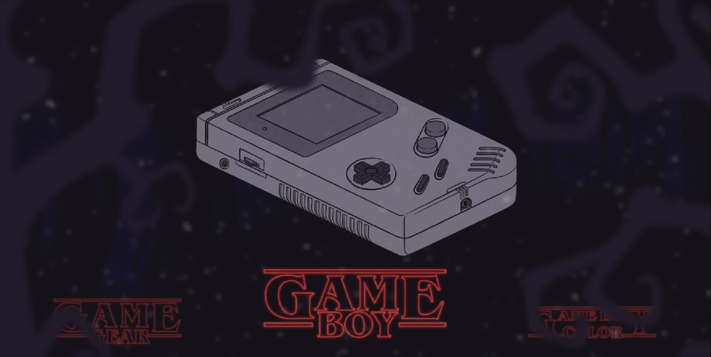
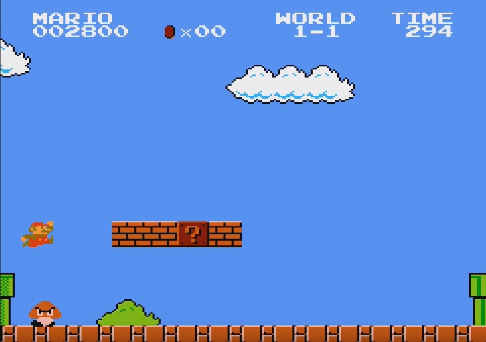

# RetroPie modern funkciókkal

- [Fejlesztői dokumentáció](https://github.com/bvlnt/rpi-beadando/wiki/Fejleszt%C5%91i-dokument%C3%A1ci%C3%B3)  
- [Használati útmutató](https://github.com/bvlnt/rpi-beadando/wiki/Haszn%C3%A1lati-%C3%9Atmutat%C3%B3)  

Projektünket **Raspberry Pi 2 Model B**-n készítettük el.  

A rendszer alapja a **RetroPie** nevű ingyenes operációs rendszer, amely *Raspbian, EmulationStation és RetroArch* alapjaival készült.  

**Szükséges hardwarek:**
- Ajánlott egy Raspberry 2 vagy annál nagyobb teljesítményű
- Kijelző (HDMI-vel rendelkező)
- USB-s vagy BlueTooth-os joystick
- Micro SD kártya (minimum 8 Gb tárhelyű)
- Billentyűzet a parancssor használatához
- HDMI kábel

Elvégzett plusz feladatok a rendszerben:  
- Feltöltöttük a rendszert a kedvenc játékainkkal ☺
- Kiegészítettük a projektet egy adatgyűjtési folyamattal, amivel valós idejűleg (!) követhetők lehetnek a játékban elért Mérföldkövek és összehasonlíthatók más felhasználókkal (használati útmutató utolsó lépéseként ez beállítható)
- Felhasználtunk egy Scrapert (*SkyScraper*) ami megjelenít egy videót (játékmenetet) a könyvtárban az adott játék mellett,
- Felhasználtunk egy témakezelőt és töltöttünk fel hozzá különböző ingyenesen elérhető témákat,
- Beüzemeltük az *SSH és SFTP* kapcsolatot, így könnyedén távolról is dolgozhatunk a projekten (vagy adhatunk hozzá további játékokat),

---
## Képernyőképek a projektről
  
  
